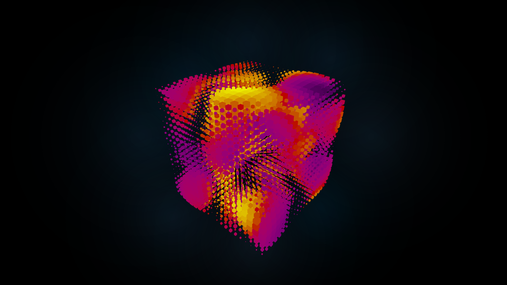

# 🧊 Meta Cube: Dynamic Instanced Voxel Grid

An interactive voxel-style 3D cube grid powered by **Three.js**. Features GPU-efficient **instanced rendering** of thousands of cubes animated with **Improved Perlin Noise**, dynamic color variation via **HSL**, and real-time control through a GUI. Includes a softly glowing sprite-based background layer and responsive mobile camera adaptation. Fully optimized with smart resizing, pixel ratio clamping, and smooth **OrbitControls** for a modern WebGL experience.

[](https://meta-cube-dun.vercel.app/)

---

## ✨ Features

- 🧊 **Instanced Cube Grid** with GPU-accelerated rendering of up to 8,000 cubes using `InstancedMesh`
- 🌈 **Noise-Driven Animation** via Improved Perlin Noise, creating organic motion and scale deformation
- 🎨** Dynamic HSL Coloring** mapped to cube distortion for a vivid, reactive aesthetic
- 🎛️ **Real-Time Controls** using lil-gui to adjust animation speed, cube size, and hue parameters
- 🌌 **Glowing Sprite Background** with procedurally placed radial gradients for ambient depth
- 🧭 **OrbitControls Support** for intuitive camera manipulation
- 📱 **Mobile-Aware Camera** that adjusts FOV and distance based on screen size
- 📐 **Responsive Canvas** styled with **TailwindCSS** for seamless full-screen integration
- 🚀 **Optimized Renderer** with capped pixel ratio, DynamicDrawUsage, and smart resizing for performance

---

## 🧠 How It Works

- Creates a 3D voxel grid using `InstancedMesh` with a total of $20^3 = 8000$ cube instances
- Applies **Improved Perlin Noise** to animate cube scale and color over time for an organic, pulsating effect
- Utilizes `Object3D` dummy transforms for efficient per-instance matrix and color updates
- Adjusts HSL hue dynamically based on noise values to produce a colorful, reactive visualization
- Integrates **lil-gui** for live parameter tweaking (speed, cube size, noise hue) without reloading
- Uses `OrbitControls` to enable smooth, interactive camera movement in 3D space
- Adds layered radial **sprite gradients** behind the grid using custom `getLayer()` function
- Ensures responsive rendering by adapting FOV and camera distance on mobile devices
- Optimizes rendering with capped device pixel ratio and dynamic buffer usage for performance

---

## 🛠️ Built With

- [Three.js](https://threejs.org/) – Core 3D engine for rendering, geometry, and instancing
- [TailwindCSS](https://tailwindcss.com/) – Utility-first CSS for responsive, full-screen layout
- [lil-gui](https://lil-gui.georgealways.com/) – Lightweight UI for real-time parameter tweaking
- [ImprovedNoise](https://threejs.org/docs/#examples/en/math/ImprovedNoise) – Used to animate cube scale and color via noise functions
- [OrbitControls](https://threejs.org/docs/#examples/en/controls/OrbitControls) – Enables smooth, interactive camera controls
- [InstancedMesh](https://threejs.org/docs/#api/en/objects/InstancedMesh) – Efficient GPU rendering of thousands of cube instances
- [TextureLoader](https://threejs.org/docs/#api/en/loaders/TextureLoader) – Loads radial gradient sprites for layered backgrounds

---

## Clone the repo

```bash
git clone https://github.com/its-riki-dev/meta-cube.git

# Install dependencies
npm install

# Start the development server
npm run dev

# Build for production
npm run build

# Preview production build
npm run preview
```

---

## 📄 License

- This project is licensed under the MIT License.
